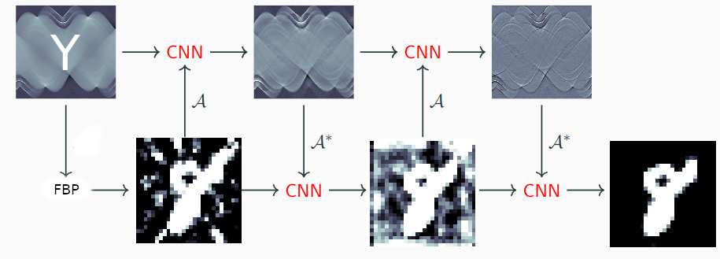
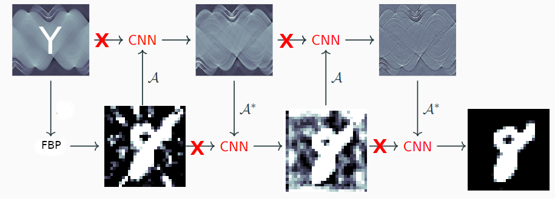
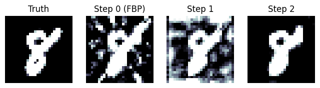
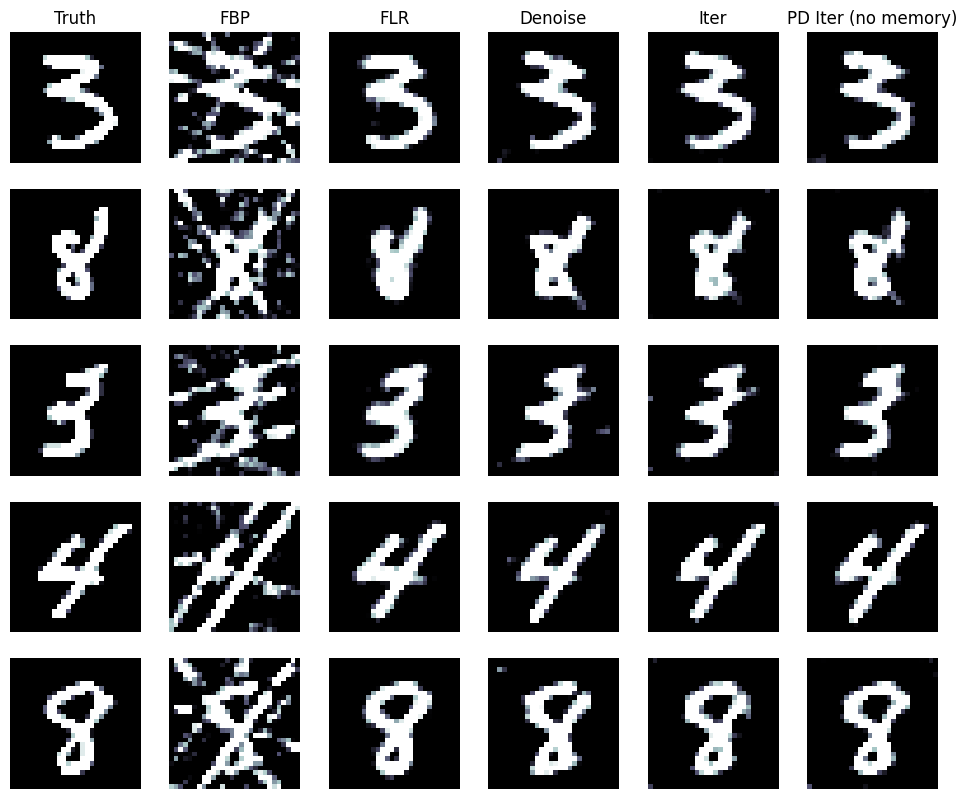

Examination for the "Inverse problems and machine learning" module 
============
**Luca Bartolomei - luca.bartolomei5@unibo.it - EIT4SEMM PhD student**

The examination consists of the following steps.

1. Make sure you have access to a computer with a CUDA capable GPU. On that computer, follow instructions in "Installation.txt" to set-up your environment and install PyTorch, ODL, ASTRA Toolbox and SciKit-image. Note that instructions are written for Linux, but you should be able to use Windows as well. 

2. Work through the examples in the iPython notebook "learned_reconstruction_pytorch.ipynb". This notebook includes the following:
(a) Simulate 2D parallel-beam tomographic data from 28 x 28 pixel images representing MNIST handwritten digits. 
Note: The reason for choosing such small 2D images is to ensure the training (for the learned methods, see (c) below) is doable on modest computing hardware within reasonable time.
(b) Set-up and perform reconstruction using two model based methods: Filtered back-projection (FBP) and total variation
(c) Set-up and perform reconstruction using two learned methods, both trained against suitable supervised data with the square 2-norm as loss. The two learned methods are: (i) learned post-processing of FBP (=convolutional neural network trained to denoise/restore a FBP reconstruction) and (ii) learned gradient descent (=unrolled gradient descent), which is described in slides 23-24 (=pages 83-85) for lecture2.

3. Implement learned primal-dual (without memory), see description in slides 25-26 (=pages 86, 88-91) for lecture2. The solution (training + test) should be contained in a iPython notebook that can be executed in an environment that is set-up as in (1) above. Make sure you train and test on same data as unrolled gradient descent in 2(c)(ii) above, see the iPython notebook "learned_reconstruction_pytorch.ipynb" for that. Share you solution by providing me with a link to a suitable repository (like GitHub) for the iPython notebook that contains the learned primal-dual implementation.

## Step 1: Installation.txt
- I build a conda environment with Python and all packages needed: I didn't use any additional package in the solution notebook, so compatibility wouldn't be problem.
  - I build from source ODL as requested.

**Select the conda kernel before import libraries**

## Step 2: learned_reconstruction_pytorch.ipynb
- I run step by step example and try to understand all phases.
  - Also I saved checkpoints so we can compare techniques from learned_reconstruction_pytorch.ipynb without train each time.
  - I copy/paste useful code here and add comments.

## Step 3: Learned Primal Dual Hybrid Gradient (Unrolled)

**Algorithm**

1. Initialize: $x_0 \in X, y_0 \in Y$
2. **for** $i=1,2,3,\dots,N$ **do**
3. &nbsp;&nbsp; $y_{i+1} \leftarrow \Gamma_{\theta^d_{i+1}}(y_i, \mathcal{A}(x_i),y)$
4. &nbsp;&nbsp; $x_{i+1} \leftarrow \Lambda_{\theta^p_{i+1}}(x_i, \partial[\mathcal{A}(x_i)]^*(y_{i+1}))$
5. $\mathcal{R}_\Theta(y) \leftarrow x_N$ with $\Theta = (\theta^d_1,\dots,\theta^p_N)$

From lecture2.pdf there is a visual rappresentation (modified with MNIST images).

Primal (X) and dual (Y) domains are respectively original MNIST image and sinogram.

This kind of architecture is a family of **Residual Networks (ResNet)**, where neural layers learn the residual to add to previous state.

Also ResNet can be seen as a particular case of **Recurrent Neural Networks (RNN)** if all layers share same weights ($\theta^d_1=\dots=\theta^d_N, \theta^p_1=\dots=\theta^p_N$)

The key idea behind is update a initial state until $N$ iterations.

Step 3 require a no memory version of PDHG, so if I understood well the update state is somehow cut off: the architecture is more similar to a traditional **Feed Forward Network**.

**Algorithm (no memory)**

1. Initialize: $x_0 \in X, y_0 \in Y$
2. **for** $i=1,2,3,\dots,N$ **do**
3. &nbsp;&nbsp; $y_{i+1} \leftarrow \Gamma_{\theta^d_{i+1}}(\mathcal{A}(x_i),y)$
4. &nbsp;&nbsp; $x_{i+1} \leftarrow \Lambda_{\theta^p_{i+1}}(\partial[\mathcal{A}(x_i)]^*(y_{i+1}))$
5. $\mathcal{R}_\Theta(y) \leftarrow x_N$ with $\Theta = (\theta^d_1,\dots,\theta^p_N)$

As done as before in IterativeNet, we use the FBP reconstruction as start of the iterative loop.

I changed the network output to show all intermediate $x_0,\dots,x_N$

As you can see the network learn how to update the initial state to achieve a result similar to groundtruth.

Also I proposed a version of learned PDHG with memory: this version shows less error than the proposed without memory.

Now I compressed all results in the table below. As you can see PDHG performs better than other methods, also with a small number of parameters.

| Method                            | Mean Error (1)  | Mean Error (2)|
|------------------------           |-----------------|---------------|
| FBP                               | 0.01927         | 0.017932
| Fully learned                     | 0.00233         | 0.002374
| FBP + learned denoiser            | 0.00281         | 0.002758
| Learned Iterative                 | 0.005150        | 0.002799
| Learned Iterative (No memory)     | -               | 0.002533
| Learned Iterative (Memory)        | -               | 0.001586

Where (1) are original errors in example notebook and (2) are error obtained by my notebook solution.

Plot MNIST chars to compare in a qualitative way the outputs of all networks.

In the end I checked the adaptation of the network with two test:

1. Learn no memory PDHG and use it in a memory runtime.
2. Learn memory PDHG and use it in a no memory runtime.

| Method                 |  Mean Error  |
|------------------------|--------------|
| (1) Learned PDHG No Memory | 0.00657  |
| (2) Learned PDHG           | 0.04607  |

The results shows that first case is more rubust to this kind of adaptation: it's an expected result because the latter one extract information from the intermediate state.

